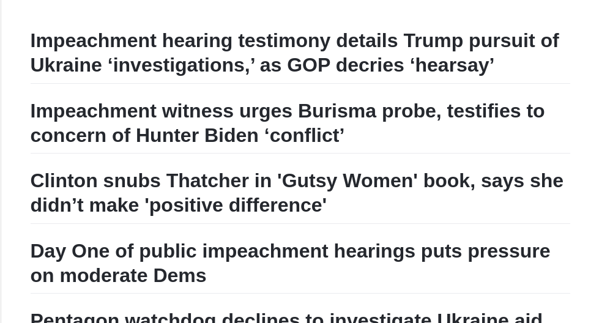
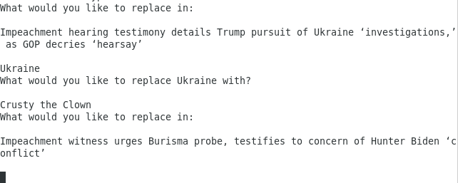
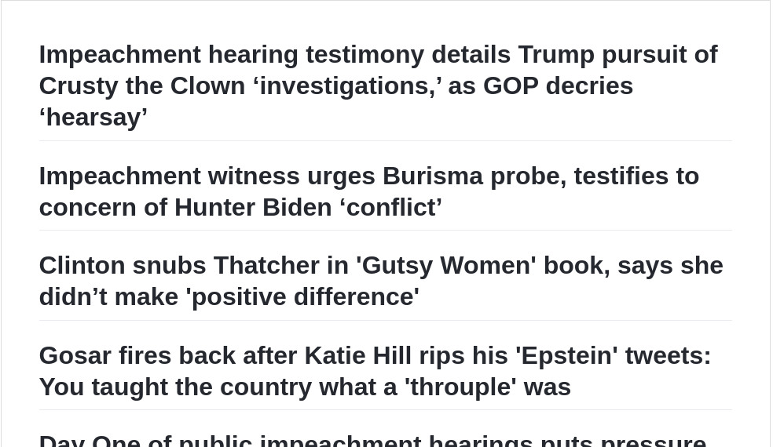

# In other words

In other words is an interactive art project about credibility of news sources. It pulls headlines from fox news and displays them to a markdown file. Viewers have access to an interface which allows them to replace strings from the headline with new strings. An example is shown below

